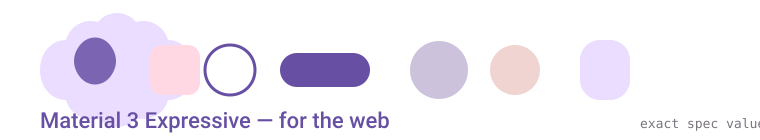

# m3-expressive-web

**📚 Documentation site:** <https://m3-expressive-web-docs.onrender.com> — every Material 3 component & foundation: about, when to use, how to use, how to configure, where to get it.

A community port of **Material 3 Expressive** to the web — Lit web components
that work in any framework (React, Vue, Angular, Svelte, vanilla JS), built on
exact values from the official spec and Google's token sources.

> **Official status:** Google's Material Web Components are in maintenance mode
> and M3 Expressive is not implemented on web by Google. This project ports the
> expressive design language — state layers, spring motion physics, shape
> morphing, and the expressive components — to the web as standards-based
> custom elements.

## Why this port (vs existing projects)

| Project | Approach | Motion fidelity | Status |
| --- | --- | --- | --- |
| @material/web (official) | Lit, tokens, no expressive | none (legacy easing) | maintenance mode |
| matraic/m3e | from-scratch, 40+ components | bezier approximations | active |
| material
-esm/material | fork of MWC | MWC easing | active |
| **this project** | Lit + exact token pipeline | CSS linear() curves generated from the canonical M3 spring constants (damping 0.9/1.0, stiffness 1400–3800) | active |

The differentiator: motion here is **numerically faithful**. The spring tokens
come from MDC-Android's motion tokens.xml — the same constants Jetpack
Compose's MotionScheme.expressive() uses — integrated from the damped harmonic
oscillator and sampled into CSS linear() easing.

## Components

| Component | Element | Expressive features |
| --- | --- | --- |
| Common buttons | md-filled-button, md-filled-tonal-button, md-outlined-button, md-elevated-button, md-text-button | state layers (8/10/10/12%), ripple, corner morph on press |
| Button group | md-button-group | "bump and react" neighbor flex, spring-driven |
| Loading indicator | md-loading-indicator | shape-morph cycle through the shape library |
| FAB menu | md-fab-menu | spring-staggered items, corner morph |
| Split button | md-split-button | connected segments, chevron spring rotation, menu |
| Toolbar | md-toolbar | corner morph on hover, slots for controls |
| Slider | md-slider | expressive tall thumb, corner morph on drag, spring growth |
| Wavy progress | md-linear-wavy-progress, md-circular-wavy-progress | amplitude grows with value, spring-eased |

## AI agent skills 🤖

The skill ships in the repo at the two locations agents auto-discover — no install needed after cloning:

- **Claude Code**: `.claude/skills/m3-expressive-web/SKILL.md` (project skill; validate with `claude plugin validate .claude/skills`)
- **Codex CLI / IDE**: `.agents/skills/m3-expressive-web/SKILL.md` (scanned from your cwd up to the repo root; invoke via `/skills` or `$`)
- **ChatGPT**: skills ship as plugins — type `@` to select one; the canonical copy and per-agent install paths live on the [agent-skills branch](https://github.com/lobsterbs/m3-expressive-web/tree/agent-skills)

This repo ships a ready-made **agent skill** on the
[`agent-skills` branch](https://github.com/lobsterbs/m3-expressive-web/tree/agent-skills)
that teaches AI coding agents to work with (and extend) this library. It's
written in the **Agent Skills open standard** (SKILL.md with YAML frontmatter),
so the same file works in Claude Code, OpenAI Codex CLI, Cursor, OpenCode,
OpenClaw, and 20+ other agents — as well as Mistral and other SKILL.md-aware
environments.

The skill encodes:
- the **exact-values contract** (state layer opacities, elevation levels,
  corner scale, canonical spring constants — never approximate)
- 
component usage and the InteractiveController extension pattern
- the research workflow for verifying spec values (m3.material.io interactive
  modules, MDC-Android tokens.xml, Compose source)

Install for your agent:

    git clone -b agent-skills https://github.com/lobsterbs/m3-expressive-web.git
    cp -r m3-expressive-web/skills/m3-expressive-web ~/.claude/skills/     # Claude Code
    cp -r m3-expressive-web/skills/m3-expressive-web ~/.codex/skills/      # Codex CLI
    cp -r m3-expressive-web/skills/m3-expressive-web .cursor/skills/      # Cursor

See [skills/README.md on the agent-skills branch](https://github.com/lobsterbs/m3-expressive-web/blob/agent-skills/skills/README.md)
for per-agent details, and [AGENTS.md](AGENTS.md) for the full contributor
contract the skill is derived from.

## Exact values used (audit trail)

### Motion springs (canonical, from MDC-Android tokens.xml)

| Spring | Damping ratio | Stiffness | Used for |
| --- | --- | --- | --- |
| fast-spatial | 0.9 | 1400 | buttons, switches, small components (position/shape) |
| fast-effects | 1.0 | 3800 | small component color/opacity |
| default-spatial | 0.9 | 700 | bottom sheets, drawers |
| default-effects | 1.0 | 1600 | partial-screen effects |
| slow-spatial | 0.9 | 300 | full-screen transitions |
| slow-effects | 1.0 | 800 | full-screen color/opacity |

Per the motion spec (m3.material.io/styles/motion/overview/how-it-works), all
component motion is driven by two tokens: expressive fast spatial and
expressive fast effects.

### State layer opacities

hover 8% · focus 10% · pressed 10% · dragged 16% · hover+focus 12%

### Elevation levels (surface tint deprecated)

0 = none · 1 = 1dp · 2 = 3dp · 3 = 6dp · 4 = 8dp · 5 = 12dp

### Shape corner scale

none 0 · extra-small 4 · small 8 · medium 12 · large 16 · extra-large 28 · extra-extra-large 48 · full 9999px

## Quick start

    git clone https://github.com/lobsterbs/m3-expressive-web.git
    cd m3-expressive-web
    npm install
    npm run 
dev        # opens the demo at localhost:8000/demo/

    

    <md-filled-button>Save</md-filled-button>

    <md-split-button variant="filled">
      Send
      
Send now

      
Schedule for later

    </md-split-button>

    <md-slider value="60"></md-slider>

## Theming

Everything themes through CSS custom properties in two tiers: --md-sys-*
(system) and --md-comp-* (component overrides). Export a scheme from Material
Theme Builder (m3.material.io/foundations/customization) and map it to the
tokens in src/tokens/m3-tokens.css. Full guide: docs/theming.md.

## Project layout

    src/
      tokens/m3-tokens.css      # design tokens: color, state, elevation, shape, motion, type
      internal/                 # primitives + InteractiveController
      motion/springs.ts         # canonical spring constants -> linear() generator
      shape/shapes.ts           # expressive shape library + morph helper
      components/<name>/        # one folder per component
    demo/index.html             # smoke-test page
    docs/                       # theming.md, architecture.md
    AGENTS.md                   # contributor & AI agent guide
    skills/ (agent-skills branch) # portable SKILL.md for AI agents

## Roadmap

- [ ] Remaining expressive components: app bars, navigation bar/rail updates
- [ ] Full 35-shape library (curated subset today)
- [ ] Emphasized typography token pairs (15 styles)
- [ ] Standard motion scheme variant (the second official scheme)
- [ ] Framework wrapper docs (React/Vue/Angular usage notes)
- [ ] Verify TODO(spec) values in slider/wavy progress against the Figma kit

## Thanks 🙏

This port stands on the shoulders of these projects and their maintainers:

- **[material-components/material-web](https://github.com/material-components/material-web)**
  (Apache-2.0) — the official Material Web Components whose token
  architecture (two-tier 
--md-sys-*/--md-comp-* CSS custom properties),
  primitive decomposition (ripple, elevation, focus ring), and naming scheme
  this port directly follows. It entered maintenance mode; we're grateful for
  the years of work by the Google team.
- **[material-components/material-components-android](https://github.com/material-components/material-components-android)**
  — source of the canonical motion spring constants (damping/stiffness in
  motion/res/values/tokens.xml) used to generate our exact linear() curves.
- **[matraic/m3e](https://github.com/matraic/m3e)** — the most complete
  community M3 Expressive web port; its component coverage and shape-morph
  approach (clip-path, normalized points) informed our implementation
  choices, and its bezier approximations motivated our exact-values niche.
- **[material-esm/material](https://github.com/material-esm/material)** —
  community fork of Material Web keeping it alive; a useful cross-reference
  for component behavior.
- **[@banegasn/components](https://banegasn.dev/blog/m3-expressive-library/)**
  — an early community M3 Expressive component set that validated the
  community demand.
- **Google's Material Design team** — for publishing the full M3 Expressive
  spec, guidelines, and Figma Design Kit at [m3.material.io](https://m3.material.io/).
- **[DeepWiki](https://deepwiki.com)** — repository documentation used to
  mine the exact token names and internal architecture of material-web.
- **[Firecrawl](https://firecrawl.dev)** — used to scrape the JS-rendered
  spec pages on m3.material.io.

If your project was used as a reference and you'd like it listed or removed,
open an issue.

## Sources

- M3 guidelines: https://m3.material.io/
- M3 Expressive announcement: https://m3.material.io/blog/building-with-m3-expressive
- Motion physics system: https://m3.material.io/styles/motion/overview/how-it-works
- MDC-Android Motion tokens: https://github.com/material-components/material-components-android/blob/master/docs/th
eming/Motion.md
- Architecture patterns adapted from material-components/material-web (Apache-2.0)

## License

Apache-2.0
